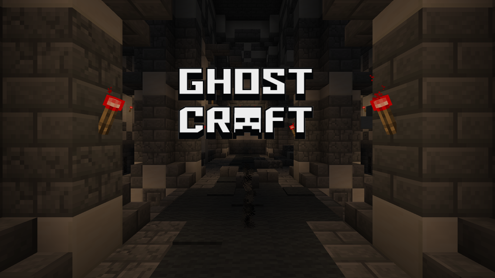
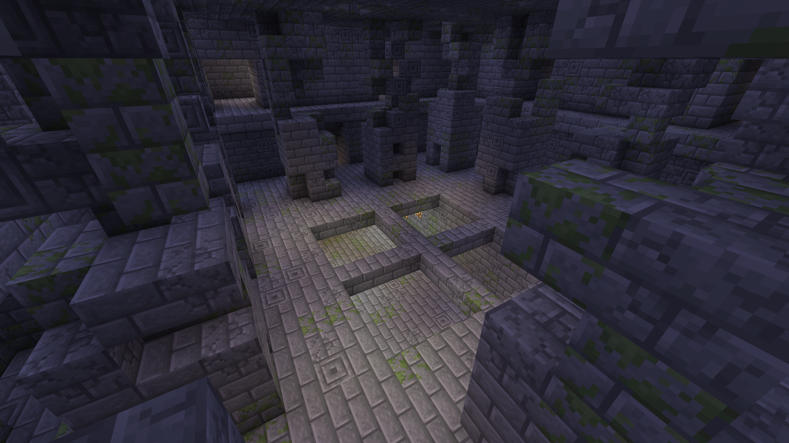
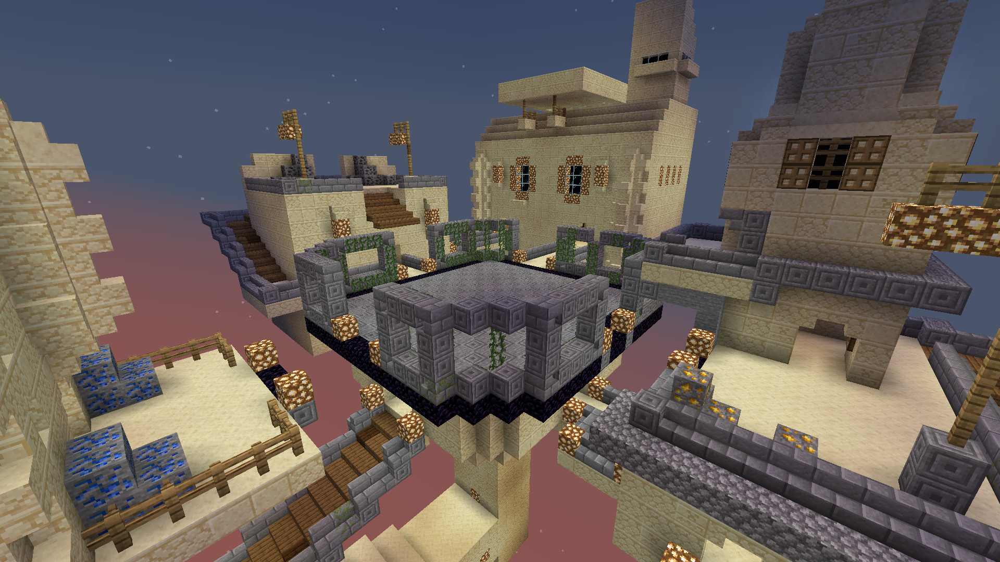
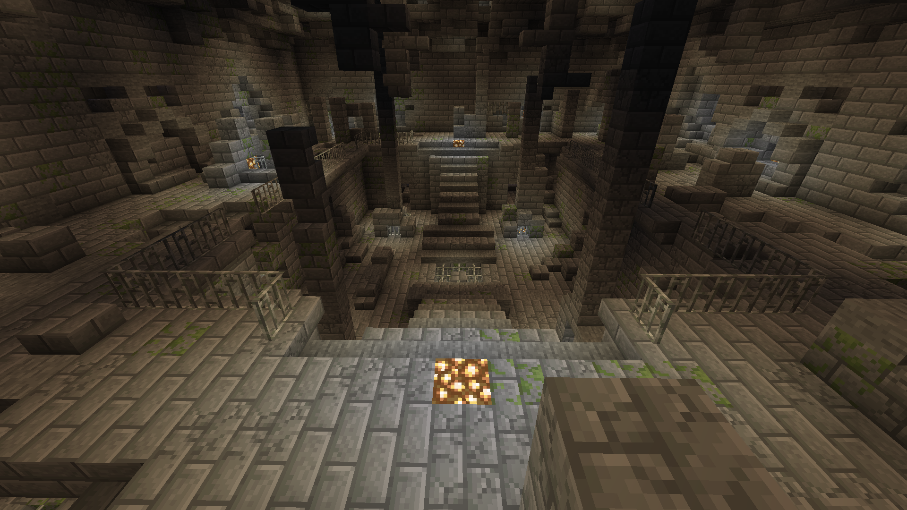
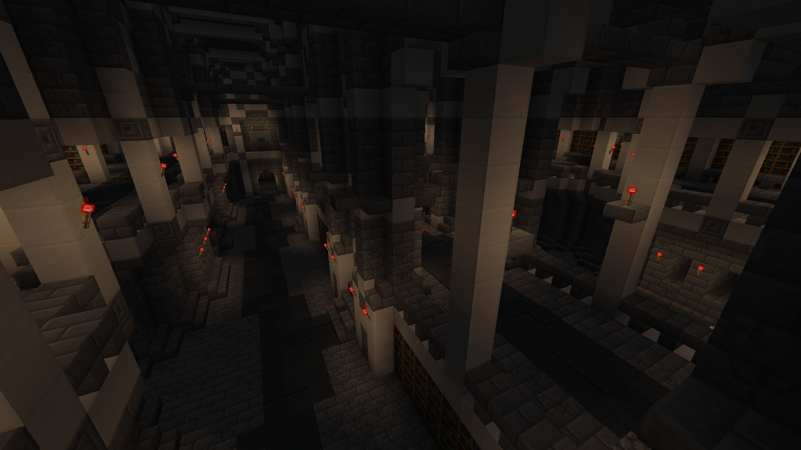

<em>Recreated by FancyPotatOS</em>

<em>Probably owned by [The ShotBow Network](https://shotbow.net/)</em>

This is my attempt at remaking a GhostCraft clone using just vanilla resources. It currently has everything I initially planned on doing - including kits and maps!

There is an open API to add your own kits, maps, items, and abilities! Eventually there will be a system to change the game mode too. Nevertheless, the game API is still available.

Please enjoy this little piece of 2013 Minecraft love.

### About Ghostcraft

Ghostcraft is a Minecraft minigame based on [The Hidden: Source](https://www.hidden-source.com/). One player is an invisible ghost, while the rest of the players are teamed together as survivors. If the survivors can kill the ghost or survive long enough, they win!

The ghost has numerous abilities such as being able to leap around and stab, as well as a handful of different grenades.

There is currently 6 kits the survivors can use, all with their own tools to help everybody survive the ghost.

There is also 4 maps available. By default, a vote can be cast to switch maps every 3 turns.

    
Temple

     
    

    
Blackout

     
    

    
Sanctum

     
    

    
Keterbrandt Library

     
    

### Requirements
- The [player_motion](https://cdn.modrinth.com/data/oDhxdGVZ/versions/aW4ph2OC/player_motion.zip) datapack
- The [BlockState](https://github.com/Triton365/BlockState/releases/download/v1.0.3/BlockState_1.21.5.zip) datapack

### Credits
- [Sanctum](https://shotbow.net/forum/threads/sanctum-a-ghostcraft-map.77827/) map created by [Subject_617](https://shotbow.net/forum/members/subject_617.1984/)
- [Katerbrandt Library](https://shotbow.net/forum/threads/map-submission-the-katerbrandt-library.326662/#post-2647846) map created by [Moshyn](https://shotbow.net/forum/members/moshyn.1122691/)

## Server Details

If you are running a server, please ensure that it is compatible with the [player_motion](https://modrinth.com/datapack/player_motion) datapack. Some optimizations from servers like Paper break some functionality like ghost boosting and the grappling hook.

This datapack requires the included resource pack. Here is some of the <b>server.properties</b> values you can set to ensure the players have access to it and use it (Otherwise you can cheat and see the ghost easily)

It includes a google drive link to my copy of the resource pack, so feel free to use it.
- require-resource-pack=true
- resource-pack=https://drive.google.com/uc?export=download&id=1eBihk_qf_e67KmNqcsr95aGCNRxn_yVU
- resource-pack-prompt=This resource pack is required to play GhostCraft. Compatible with vanilla Minecraft.

